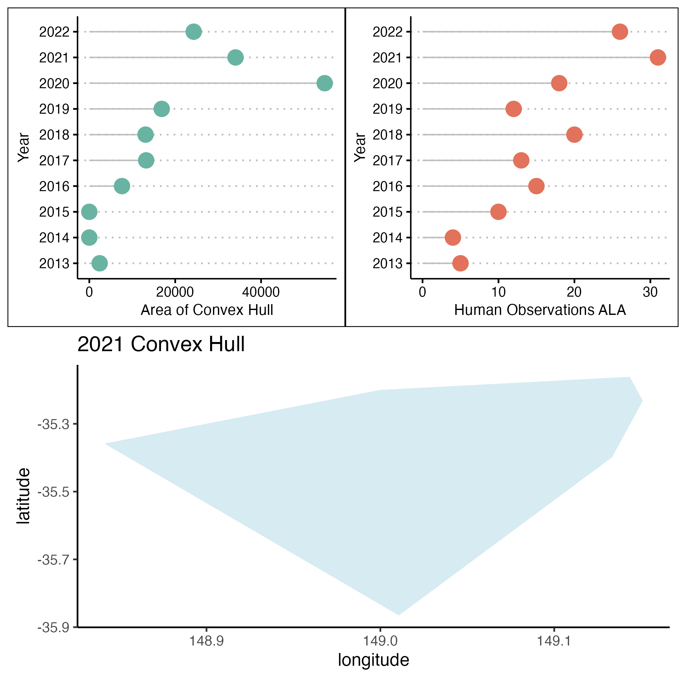

# skinks-occurrences
Studying sampling bias for the garden skink.

### Task description and objectives
The minimum convex hull is a way to represent the location and distribution of a species and it is dependent on occurrence points. 

The minimum convex hull is not perfect, has many considerations, and it is suitable for when the occurrence data is abundant and with no bias and error. Outliers and wrong occurrences can really influence the validity of a minimum convex hull. 

Despite these considerations, I wanted to study how the distribution, but primarily the occurrence area of the garden skink has shifted through the years. I purposedly selected human observations, because I wanted to determine if during covid years the ocurrence area of the garden skink decreased. Less people observing maybe resulted in smaller occurrences areas (note considerations of convex polygon)

The overarching prupose of my task was to visualise sampling bias. 

From this preliminary plot, and considering that the area values are partially incorrect (see code for more detail), it does seem that 2020 and 2021 (covid years) had the highest values of occurrence area for the garden skink. This may have been a result of many spatially separated observations (i.e. making the convex polygon really big) or many people where outside/ in their gardens and providing occurrence data.

From a technical perpestive, my code demonstrates data wrangling using tidyverse and spatial libraries, data visualisation with ggplot. Data gathering was done via APIs and HTTP requests. I created a small function that was then reapplied for many parameter combinations using the lapply function. 

Thank for your time and consideration for this position

### Resident skink

This is my resident garden skink 😅

