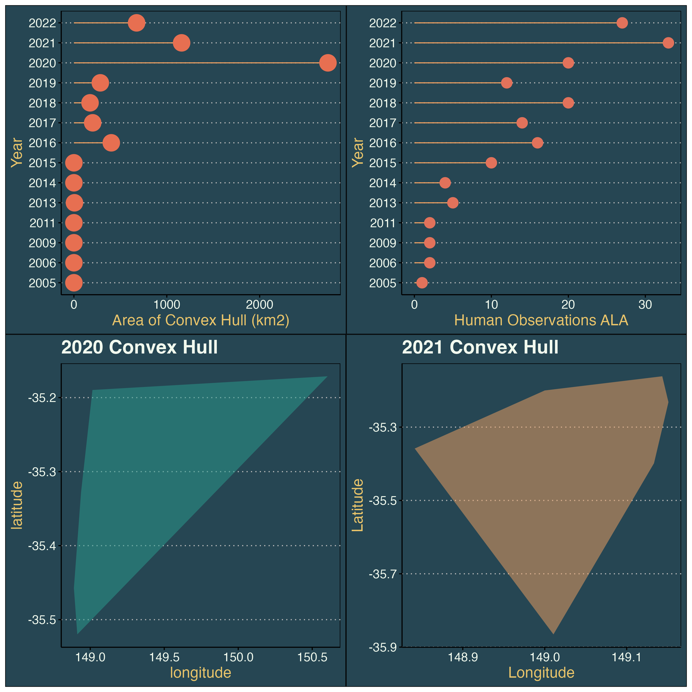
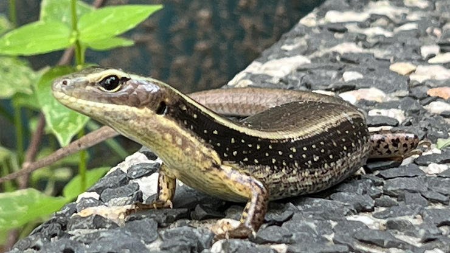

# skinks-occurrences
Studying sampling bias of the garden skink in ACT.

### Occurrence area from human observations to ALA
The minimum convex hull is a way to represent the location and distribution of a species and it is dependent on occurrence points. 

The minimum convex hull is not perfect, has many considerations, and it is suitable for when the occurrence data is abundant and with no bias and error. Outliers and wrong occurrences can really influence the validity of a minimum convex hull. 

Despite these considerations, I wanted to study how the distribution, but primarily the occurrence area of the garden skink has shifted through the years. I purposedly selected human observations, because I wanted to determine if during covid years the ocurrence area of the garden skink decreased. Less people observing maybe resulted in smaller occurrences areas (note considerations of convex polygon)

The overarching prupose of my task was to visualise sampling bias. 

 
 2020 and 2021 (covid years) had the highest values of occurrence area for the garden skink. This may have been a result of many spatially separated observations (i.e. making the convex polygon really big) (see 2020 convex hull) or many people where outside/ in their gardens and providing occurrence data (see human observations to ALA in 2021)

For reference, ACT's area in km2 is ~2,300, which is similar to the occurrence area of the garden skink in 2020. 

### Resident skink

This is my resident garden skink 😅

